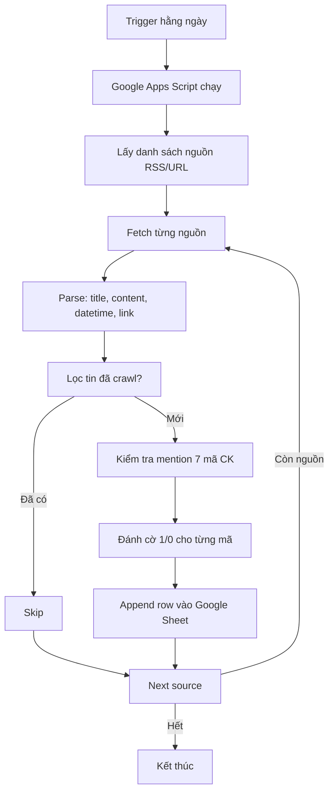

## Chi tiết

### 1. Trigger
- Time-driven: mỗi ngày 1 lần (ví dụ 8h sáng)
- Có thể chạy thủ công để test

> [!tip] Xử lý trùng lặp
> Dùng cột `Link` làm key. Kiểm tra Link đã tồn tại trong Sheet chưa trước khi append.

### 2. Xử lý lỗi
- Nếu 1 nguồn lỗi → ghi log, skip, không ảnh hưởng nguồn khác
- Nếu timeout → retry 1 lần, nếu vẫn lỗi thì bỏ qua

### 3. Backfill lịch sử
- Script riêng (không chạy trigger)
- Crawl từ RSS archive hoặc search Google site:...
- Giới hạn request để tránh rate limit

## Liên kết
- Xem [[Projects/DA2/overview|Tổng quan dự án]]
- Xem [[Projects/DA2/feature|Tính năng]] chi tiết
