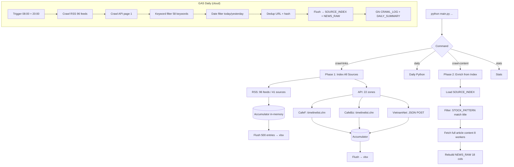

## GAS daily() 7 bước
1. **Crawl RSS** (96 feeds, fetchUrl + XmlService.parse)
2. **Crawl API** (22 zones, page 1)
3. **Keyword filter** (findMatchingKeyword — substring match case-insensitive)
4. **Date filter** (isRecentDate — hôm qua/hôm nay)
5. **Dedup** (URL + content_hash)
6. **Flush** → SOURCE_INDEX + NEWS_RAW
7. **Ghi log** → CRAWL_LOG + DAILY_SUMMARY

## Batch Accumulator
- `_idx_links: Set`: in-memory dedup
- `_idx_accumulator: Array`: pending SOURCE_INDEX rows
- `_raw_accumulator: Array`: pending NEWS_RAW rows
- Flush khi hết daily() hoặc ≥500 entries
